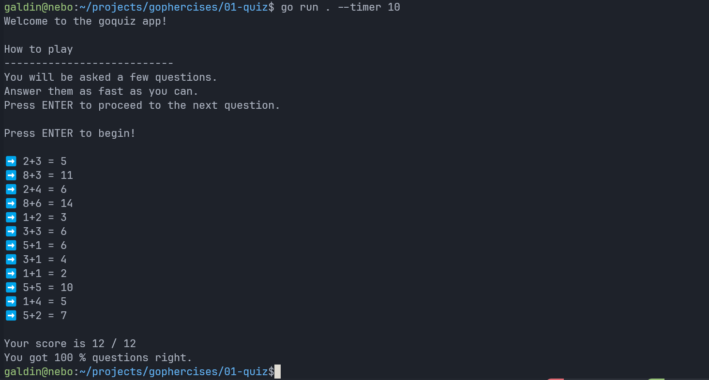
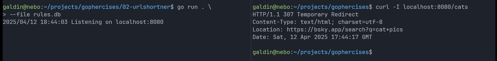
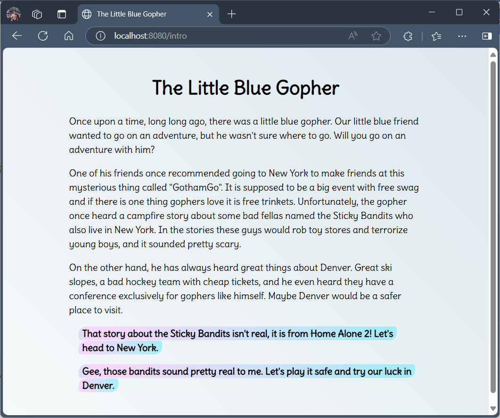

# gophercises

I'm following the exercises at [gophercises](https://gophercises.com) in this repo.

## 01 - Quiz

```sh
cd 01-quiz
go run . --timer 30
```



## 02 - URL Shortner

```sh
cd 02-urlshortner

# Run using a sqlite DB
# The DB will autogenerate if it did not already exist
go run . --file rules.db

# Run using an existing JSON config
go run . --file config.json

# Run using an existing YAML config
go run . --file config.yaml
```



## 03 - Choose your own adventure

```sh
cd ./03-adventure

go run . --mode text # Run in text mode
go run . --mode web  # Run in web mode
```



